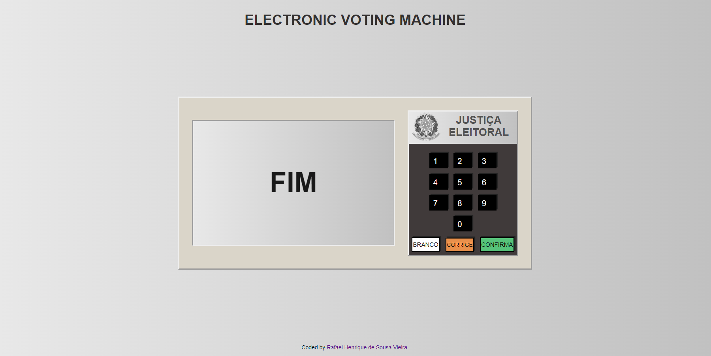
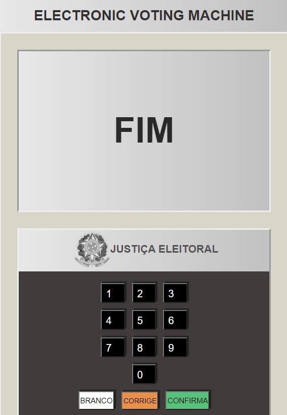

# Electronic Voting Machine

This project was made to create an electronic voting machine, using html, css and javascript

## Table of contents

- [Overview](#overview)
  - [The challenge](#the-challenge)
  - [Screenshot](#screenshot)
  - [Links](#links)
- [My process](#my-process)
  - [Built with](#built-with)

## Overview

### The challenge

Users should be able to:

- Choose the desired candidate and vote for him
- Use all number buttons and white buttons, correct and confirm
- View the desired candidate according to the number entered

### Screenshot

  - Desktop
  
    
    
  - Mobile
  
    

### Links

- Live Site URL: https://eletronic-voting-machine.netlify.app

## My process

### Built with

- Semantic HTML5 markup
- CSS custom properties
- Flexbox
- CSS Grid
- Mobile-first workflow
